# Przetwarzanie danych w chmurach obliczeniowych

Demo aplikacji => https://lego-shop-client.vercel.app/

Z racji wykorzystania serwisu Heroku jako hostingu dla serwera, przy pierwszym wejściu na stroną można doświadczyć długiego ładowania zawartości strony ze względu na usypianie nieaktywnych instancji przez Heroku.

## Cel projektu

> W ramach zajęć należy wykonać jeden projekt typu "proof of concept" wykorzystujący grafową bazę danych Neo4J z interfejsem dostępu do bazy wykonanym w ramach dowolnej technologii internetowej ( aplikacja typu SPA, aplikacja oparta o technologię MVC lub wykorzystująca RESTful i AJAX ).
Do realizacji projektu można wykorzytać dowolne środowisko udostępniające rozwiązania chmurowe ( AWS, IBM Cloud, Microsoft Azure czy Heroku). W ramach projektu można wykorzystać bazę danych Neo4J dostępną w ramach usługi DBaaS w serwisie Neo4J AuraDB.

## Tematyka projektu

Tematyką projektu został system rekomendacji produktów z wykorzystaniem grafowej bazy danych neo4j. W celu zrealizowania takiego zadania oraz jego prezentacji utworzony został uproszczony sklep internetowy z klockami LEGO. 

Aplikacja wynikowa zawierała następujące funkcjonalności:
* zakładanie konta
* logowanie
* wyświetlanie produktów dostępnych w ofercie
* komponowanie i składanie zamówienia (dodawanie/usuwanie produktów do/z koszyka, potwierdzanie zamówienia)
* przeglądanie historii złożonych zamówień
* ocenianie kupionych produktów
* wyświetlanie polecanych produktów

## Frontend

W ramach interfejsu użytkownika stworzona została aplikacja webowa. Do jej zbudowania wykorzystano bibliotekę React wraz z frameworkiem Next.js zapewniającym między innymi renderowanie po stronie serwera, optymalizację pod kontem SEO oraz optymalizację zdjęć.
### Interfejs aplikacji

#### **Strona główna**

Na samej górze wyświetlane są najwyżej ocenianie produkty. Niżej, po lewej stronie pokazana jest lista dostępnych kateogrii produktów natomiast po jej prawej stronie zaczyna się siatka kart produktów dostępnych w sklepie.

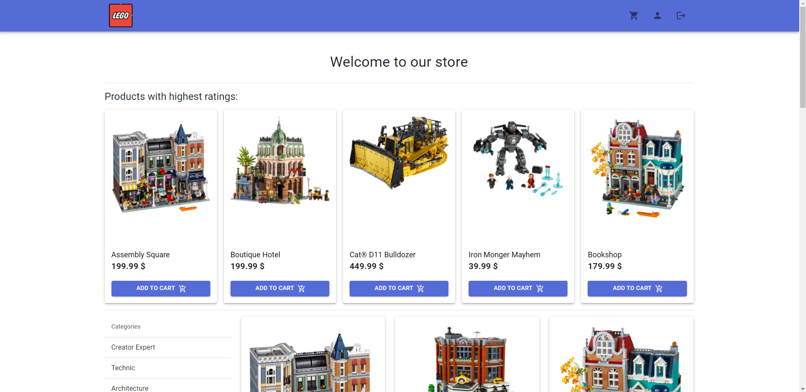

#### **Strona produktu**

Prezentuje większe zdjęcie danego produktu wraz ze szczegółowymi informacjami o tym produkcie. Pod tymi informacjami znajduje się sekcja z produktami, które inni użytkownicy kupowali razem z danym produktem.

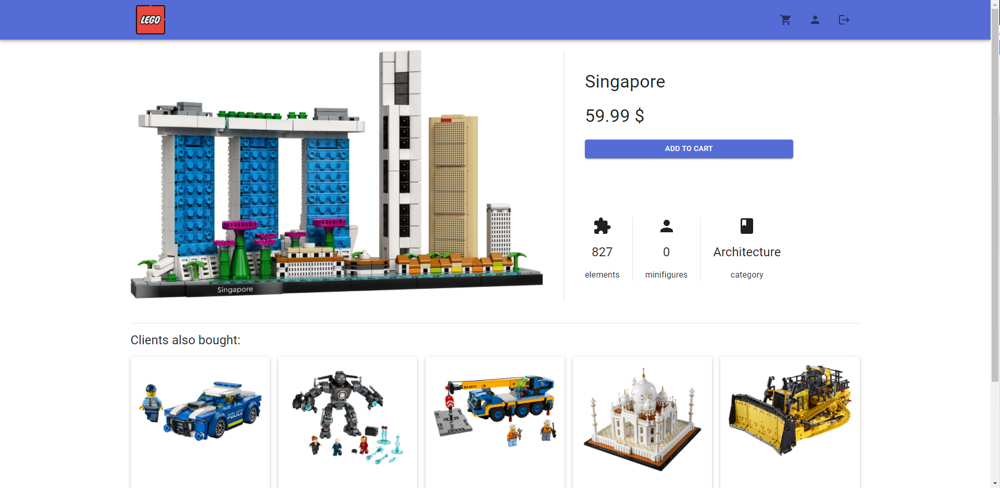
  
#### **Koszyk**

Zawiera listę produktów znajdujących się w koszyku, proste podsumowanie zamówienia mówiące o ilości produktów w koszyku oraz całkowitej cenie zamówienia oraz przycisk do jego zatwierdzenia. Z poziomu koszyka możemy również usuwać produkty.

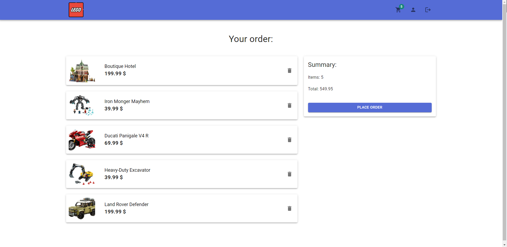

#### **Profil - personalne rekomendacje**

W górnej części strony profilowej znajdują się personalne rekomendacje produktów, będące wynikiem obliczenia podobieństwa użytkowników przy użyciu wpółczynnika korelacji Perasona oraz zastosowania metody k najbliższych sąsiadów.

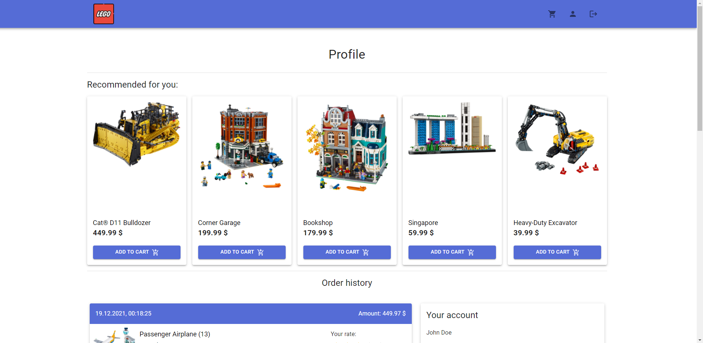

#### **Profil - historia zamówień**

Kolejną sekcją strony profilowej jest historia zamówień użytkownika. Przy każdej pozycji zamówienia istnieje możliwość wystawienia oceny produktu, przyznając mu od 0 do 5 gwiazdek. Po wystawieniu opinii można ją później edytować.

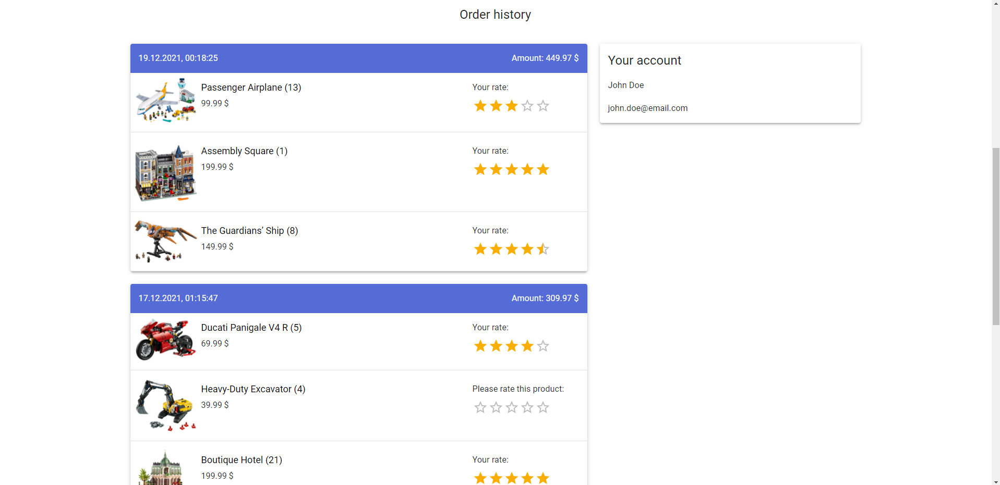
#### **Panel administratora**

Panel administratora zawiera dwa dodatkowe przyciski, które otwierają okna z formularzami do dodawania nowej katwgorii produktów oraz samego produktu.

Aby przejść do panelu administratora należy ręcznie dodać do adresu url strony głównej, przyrostek `/admin`

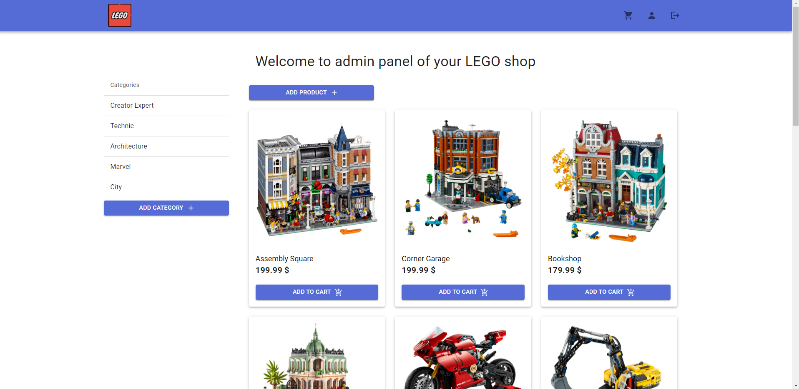

#### **Okno dodawania produktu**

Wyświetla forumalrz dodawania nowego produktu. Aby produkt został utworzony należy wypełnić wszystkie pola. Zdjęcie produktu podać należy w postaci linku do dostępnego zdjęcia, najlepiej z sieci CDN. Zalecane jest aby dodawać zdjęcia kwadratowe.

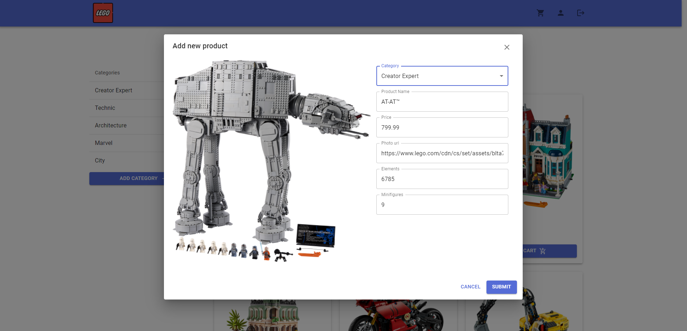

#### **Strona rejestracji**

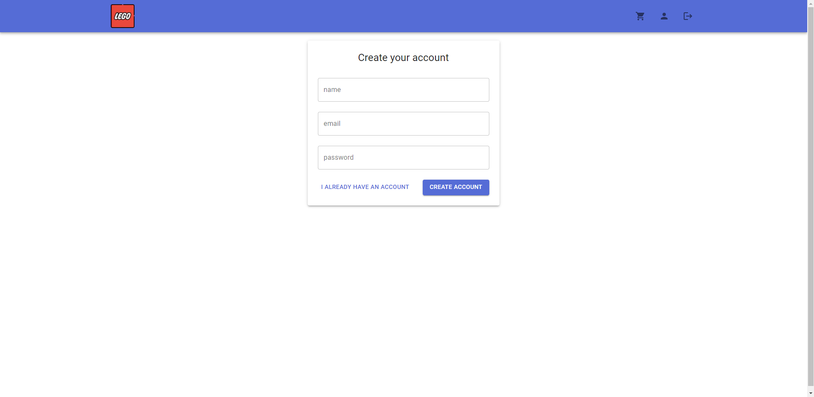

#### **Strona logowania**

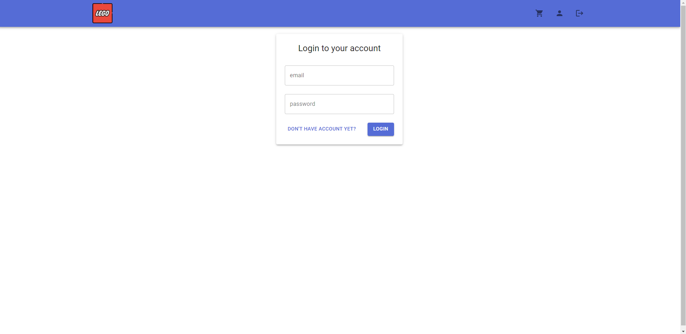
## Backend

Serwer aplikacji powstał przy użyciu technologi Node.js oraz biblioteki Express w języku TypeScript. 

Implementacja podzielona została na dwie warstwy - kontrolry (controllers) oraz serwisy (services). Zadaniem kontrolerów jest routingu zapytań dla zasobu za który dany kontroler odpowiada oraz ekstrakcja danych niezbędnych do realizacji okreslonego żądania. Dane w zależności od zapytania przesyłane były:
* w ciele zapytania (request.body) - dane do zamówienia czy utworzenia nowego produktu
* parametrach url (request.params) - identyfikatory (id) produktu, który chcemy pobrać czy ocenić: `/products/:id/rate`
* parametrach zapytania (request.query) - identyfikator użytkownika, dla któego chcemy pobrać spersonalizowane rekomendacje: `products/recommendations?user=<user-id>`

Kontrolery mają dostęp do wybranch serwisów, które odpowiedzialne są za wykonanie zapytania do bazy danych i zwrócenie pożądanego rezultatu. Serwisy operują bezpośrednio na sesjach z bazą dancyh neo4j za pomocą sterownika `neo4j-driver` udostepnianego w ramach biblioteki npm.

### Struktura REST API:

#### Użytkownicy
* `POST /users/login` - logowanie
* `POST /users/register` - utworzenie konta
#### Kategorie produktów
* `GET /categories` - pobranie wszystkich dostępnych kategorii produktów
* `POST /categories` - utworzenie nowej kategorii
#### Produkty
* `GET /products` - pobranie wszystkich produktów
* `GET /products/best-rated` - pobranie najwyżej ocenianych produktów
* `GET /products/recommended` - pobranie produktów rekomendowanych dla danego użytkownika
* `GET /products/:id` - pobranie danych konkretnego produktu
* `GET /products/:id/also-bought` - pobranie listy produktów, które były kupowane wraz z zadanym produktem
* `POST /products` - utworzenie nowego produktu
* `POST /products/:id/rate` - dodanie oceny produktu

#### Zamówienia
* `POST /orders` - utworzenie nowego zamówienia
* `GET /orders/history` - pobranie historii zamówień użytkownika

## Struktura bazy danych

Węzły zdefiniowane w ramach struktury bazy danych
* User

  ```ts
  id: number;
  name: string;
  email: string;
  password: string;
  ```
* Category

  ```ts
  id: number;
  name: string;
  ```
* Product

  ```ts
  id: number;
  name: string;
  category: string;
  price: number;
  imageUrl: string;
  elements: number;
  minifigures: number;
  ```
* Order
  ```ts
  id: number
  ```

Relacje występujące pomiędzy węzłami
* BELONGS_TO - produkt należy do kategorii

  ```ts
  id: number;
  ```
* CONTAINS - zamówienie zawiera produkt

  ```ts
  id: number;
  ```
* PLACED - zamówienie złożone przez użytkownika

  ```ts
  id: number;
  time: number;
  ```
* RATES - ocena produktu przez użytkownika

  ```ts
  id: number;
  value: number
  ```

Zestawienie węzłów wraz z relacjami pomiędzy nimi, w notacji języka Cypher:
* `(:Product)-[:BELONGS_TO]->(:Category)`
* `(:Order)-[:CONTAINS]->(:Product)`
* `(:User)-[:PLACED]->(:Order)`
* `(:User)-[:RATES]->(:Product)`

Poniżej zamieszczone zostały zrzuty ekrany z narzędzia noe4j browser, które pozwalają na lepsze zobrazowanie modelu danych i utworzonych relacji.

Podgląd zawartości bazy danych

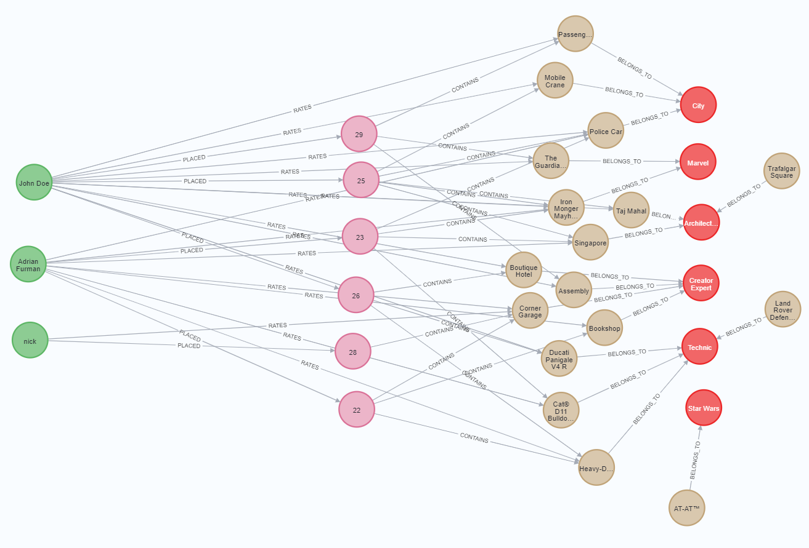


Kategorie i należące do nich produkty

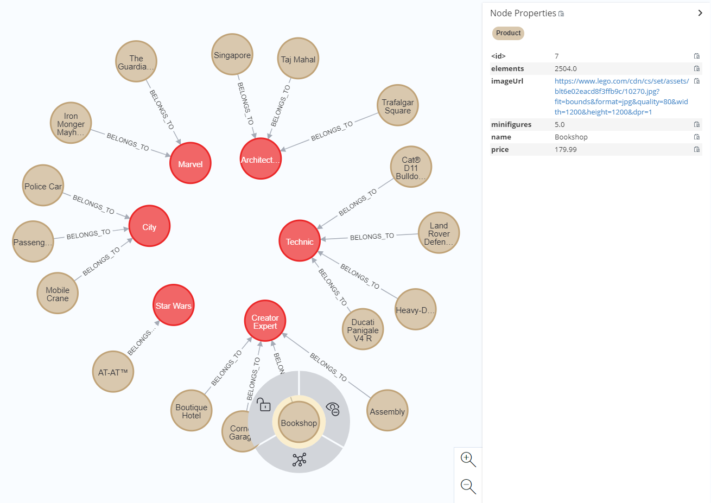

Użytkownik, jego zamówienie wraz z produktami oraz oceny produktów

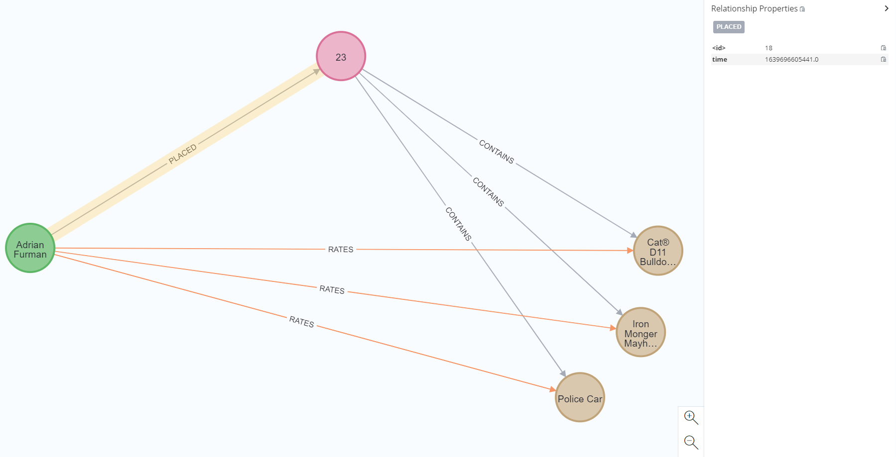
## System rekomendacji produktów


Zapytanie zwracające najwyżej oceniane produkty - jego rezultat wyświetlany jest na stronie głównej sklepu, pod nagłówkiem "Products with highest ratings"

```Cypher
MATCH (p:Product)<-[r:RATES]-(u:User)
WITH p, AVG(r.value) as rating
RETURN ID(p) as id, p.name as name, p.price as price, p.elements as elements, p.minifigures as minifigures, p.category as category, p.imageUrl as imageUrl, rating
ORDER BY rating DESC LIMIT 5
```

Zapytanie zwracające produkty, które znajdowały się wraz z danym produktem w dotychczasowych zamówieniach - rezultat tego zamówienia wyświetlany jest na stronie konkretnego produktu, poniżej szczegółów na temat danego produktu, pod nagłówkiem "Clients also bought"

```Cypher
MATCH (p:Product) WHERE ID(p) = $productId
MATCH (p)<-[:CONTAINS]-(o:Order)-[:CONTAINS]->(rec:Product) WHERE rec <> p

RETURN ID(rec) as id, rec.name as name, rec.price as price, rec.elements as elements, rec.minifigures as minifigures, rec.category as category, rec.imageUrl as imageUrl, COUNT(*) as numberOfOrders 

ORDER BY numberOfOrders DESC LIMIT 5
```

Zapytanie zwracające produkty dopasowane do preferencji użytkownika. Rekomendacja oparta jest o metryke podobieństwa preferencji użytkowników. Podobieństwo obliczane jest za pomocą współczynnika korelacji Pearsona dla ocen jakie użytkownicy wystawiają produktom po ich zakupie. Jeśli dwaj użytkownicy - A oraz B, wystawiają podobne opinie tym samym produktom, prawdopodobnie mają podobne gusta i skłonni będą kupować podobne produkty. Bazując na takim założeniu można polecić użytkownikowi A te produkty zakupione przez użytkownika B, które on wysoko ocenił a użytkownik A jeszcze ich nie posiada i vice versa. 

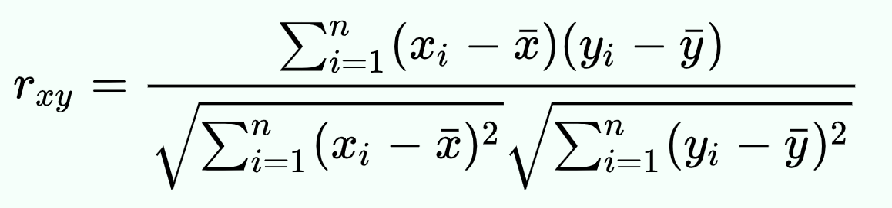

Ponadto wykorzystać można metodą k najbliższych sąsiadów (kNN) aby zgromadzić większą i możliwie bardziej trafną pulę produktów do zarekomendowania.

Dodatkowym atutem podobieństwa Pearsona jest fakt iż ta metryka uwzględnia ogólną zasadę, że różni użytkownicy mają różne średnie swoich ocen - niektórzy z reguły wystawiają wyższe oceni niż inni. Nie zważając na ten fakt i używając na przykład prostego podobieństwa cosinusowego, mogilbyśmy otrzymać nieco gorsze i mniej skuteczne rekomendacje.

```Cypher
MATCH (u1:User) WHERE ID(u1) = $userId
MATCH (u1)-[r:RATES]->(p:Product)
WITH u1, avg(r.value) AS u1_mean
        
MATCH (u1)-[r1:RATES]->(p:Product)<-[r2:RATES]-(u2)
WITH u1, u1_mean, u2, COLLECT({r1: r1, r2: r2}) AS ratings WHERE size(ratings) > 1
        
MATCH (u2)-[r:RATES]->(p:Product)
WITH u1, u1_mean, u2, avg(r.value) AS u2_mean, ratings
        
UNWIND ratings AS r
        
WITH sum( (r.r1.value-u1_mean) * (r.r2.value-u2_mean) ) AS nom, sqrt( sum( (r.r1.value - u1_mean)^2) * sum( (r.r2.value - u2_mean) ^2)) AS denom, u1, u2 
WHERE denom <> 0
        
WITH u1, u2, nom/denom AS pearson
ORDER BY pearson DESC LIMIT 10
        
MATCH (u2)-[r:RATES]->(p:Product) WHERE NOT EXISTS( (u1)-[:RATES]->(p) )
        
RETURN ID(p) as id, p.name as name, p.price as price, p.elements as elements, p.minifigures as minifigures, p.category as category, p.imageUrl as imageUrl, SUM( pearson * r.value) AS score

ORDER BY score DESC LIMIT 5
```

Rezultat powyższego zapytania zobaczyć można na stronie profilowej użytkownika, pod nagłówkiem "Recommended for you".

## Wdrożenie apliakcji

Część serwerowa aplikacji zamieszczona została na serwisie Heroku w ramach darmowego planu korzystania z platformy.

Część kliencka aplikacji hostowana jest w ramach usług oferowanych przez twórców frameworka Next.js - platformę Vercel. 

Jako bazę danych wykorzystano darmową instancę bazy neo4j - AuraDB.

## Wykorzystane technologie

* Frontend
  * React
  * Next.js
  * MaterialUI
* Backend
  * Nodejs
  * Express
  * neo4j-driver
* Baza danych - neo4j AuraDB

## Źródła:
* [Personalized Product Recommendations with Neo4j](https://guides.neo4j.com/sandbox/recommendations/index.html)
* [Język Cypher](https://neo4j.com/docs/cypher-manual/current/)
* [oficjalny sklep LEGO - źródło danych i zdjęć](https://www.lego.com/en-us)